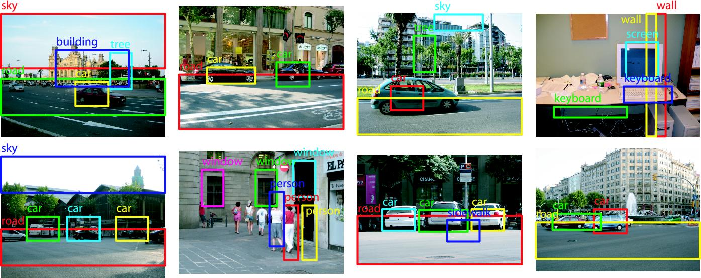

# Tensorflow-object-detection
Detect different objects in an image with TensorFlow

## Intro

Inference Graph is in zip file
frozen_inference_graph.zip

### Do not forget to unzip the file

Click on this image to se how object detection works:

## Getting started
<ul>
  <li>Put an image in test_images folder </li>
  <li> Then run the object_detection.ipynb file to get results </li>
 </ul>
 
 

 
## Different models
You can use different pre-trained model like for SSD,R-CNN, Faster-RCNN

But here i have used ssd  
  
Read more about <b>SSD</b> [here](https://arxiv.org/pdf/1512.02325.pdf)
  

 

 
## Results

<ul>
<li> Get Ground-Truth with labelImg which helps you to draw bounding box and save them as json files </li>
<li>Then you run result.py to know how your model has performed</li>
</ul>

<b>Created by:</b> <i><b>Anubhav Shukla</b></i>
 
 
<i>This application of object detection is also given in the official github page of tensorflow for object detection.</i>

### Check out this in action at
  https://www.anubhv.com/detect

